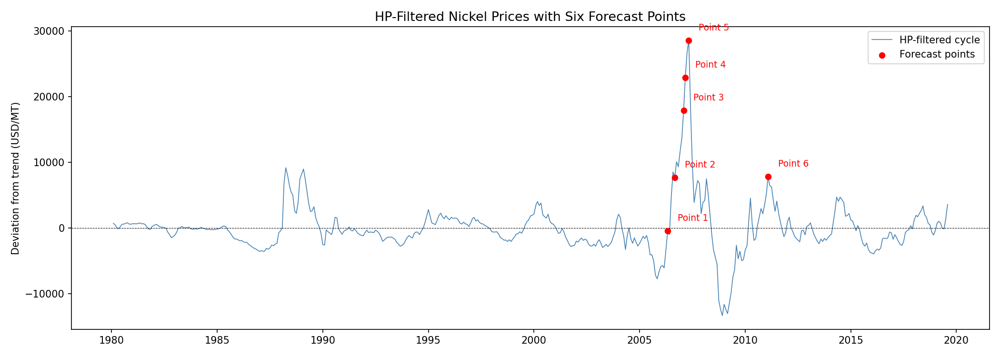

# Mixed Causal-Noncausal Autoregressive Models for Bubble Forecasting

Replication of Hecq & Voisin (2021) for bachelor thesis at VU Amsterdam.

## Overview

This repository implements mixed causal-noncausal autoregressive (MAR) models for forecasting speculative bubbles. MAR models combine backward-looking (causal) and forward-looking (noncausal) components to generate locally explosive episodes within a globally stationary framework.

The project replicates two numerical forecasting methods:
- **Method 1 (Simulation-based):** Approximates predictive densities by drawing future error sequences and weighting by consistency with current observations
- **Method 2 (Sample-based):** Uses historical data to approximate densities, introducing a learning mechanism that adjusts probabilities based on past realizations

Applied to the 2007 Nickel price bubble, both methods successfully capture bi-modal predictive densities, showing both crash and continuation scenarios that standard point forecasts miss entirely.

**Note on Data:** This replication uses World Bank Global Economic Monitor data. The original paper uses IMF Primary Commodity Prices. Minor parameter differences result from this data source variation.

## Installation

### Prerequisites
- **R** (≥ 4.0) with RStudio
- **Python** (≥ 3.10)
- **Git**

### Setup

**1. Clone the repository**
```bash
git clone https://github.com/DerekNigten/mar-bubble-forecasting.git
cd mar-bubble-forecasting
```

**2. Install R dependencies**

Open RStudio and run:
```r
install.packages("devtools")
devtools::install_github("cran/MARX")
install.packages("mFilter")
```

## Usage

### Step 1: R Estimation

The R script estimates the MAR(1,1) model and exports processed data.

Open `r/marx_estimation.R` in RStudio and run the entire script.

**Runtime:** ~2 minutes

**Outputs:**
- `data/processed/mar_parameters.csv` — estimated φ, ψ, df, scale with standard errors
- `data/processed/nickel_filtered.csv` — HP-filtered cycle, noncausal component, residuals

### Step 2: Python Notebooks

Open Jupyter and run notebooks sequentially:

**Execution order:**

1. **`01_data_exploration.ipynb`** — visualizes raw prices, HP-filtered cycle, noncausal component  
   Outputs: 3 figures in `outputs/figures/`

2. **`02_estimation_results.ipynb`** — presents parameter estimates, residual diagnostics, non-normality tests  
   Outputs: 2 figures in `outputs/figures/`

3. **`04_empirical_application.ipynb`** — applies forecasting methods to the 2007 Nickel bubble  
Outputs: crash probabilities at six forecast points, density plots showing bi-modality

**Runtime:** Notebooks 01, 02, 04 combined: ~5 minutes

**Note:** Notebook `03_forecasting_methods.ipynb` requires Monte Carlo results (see Monte Carlo Validation section below).

### Step 3: Monte Carlo Validation (Optional)

Validates forecasting methods by simulating MAR(0,1) processes with known parameters.
```bash
python run_monte_carlo.py
```

**Runtime:** ~6-8 hours on CPU (200 replications, N=100,000)  
**Note:** For faster testing, reduce settings in `run_monte_carlo.py` to `n_replications=50, N=10_000` (~30 minutes)

**Outputs:**
- `outputs/tables/table1_simulation.csv` — Method 1 validation
- `outputs/tables/table2_sample.csv` — Method 2 validation

Once complete, run notebook **`03_forecasting_methods.ipynb`** to format these results into tables. 

## Project Structure
```
mar-bubble-forecasting/
├── README.md                 
├── TECHNICAL_DOCUMENTATION.md
├── requirements.txt          # Python dependencies
│
├── data/
│   ├── raw/                  # Original Nickel prices CSV
│   └── processed/            # HP-filtered data, MAR parameters
│
├── r/
│   └── marx_estimation.R     # MAR model estimation script
│
├── src/
│   ├── preprocessing.py      # Data loading
│   ├── closed_form.py        # Cauchy closed-form benchmark
│   ├── forecasting_sim.py    # Method 1: simulation-based
│   ├── forecasting_sample.py # Method 2: sample-based
│   └── monte_carlo.py        # Validation framework
│
├── run_monte_carlo.py        # Monte Carlo execution script
│
├── notebooks/
│   ├── 01_data_exploration.ipynb
│   ├── 02_estimation_results.ipynb
│   ├── 03_forecasting_methods.ipynb
│   └── 04_empirical_application.ipynb
│
└── outputs/
    ├── figures/              # All generated plots
    └── tables/               # CSV tables 
```

## Key Results

## Key Results

### Forecast Points on 2007 Nickel Bubble



Six points marked along the bubble trajectory, from early buildup (Q0.48) to peak (Q1.00).

### Bi-Modal Predictive Densities


During bubble episodes (Points 2-5), the predictive density splits into crash mode (near 0) and continuation mode. Point 1 (normal period) shows uni-modal density.

### Crash Probabilities 

At each forecast point during the bubble, we compute the probability of a 20% price drop in the next month.

| Point | Date | Level | Simulation-based | Sample-based | Learning Effect |
|-------|------|-------|------------------|--------------|-----------------|
| 2 | 2006-09 | Early bubble (Q0.96) | 33% | 51% | +19% |
| 3 | 2007-02 | Mid bubble (Q0.99) | 33% | 59% | +26% |
| 5 | 2007-05 | Peak (Q1.00) | 30% | 59% | +29% |

Full table: `outputs/tables/table3_crash_probabilities.csv`

## Documentation

Full methodology and implementation details → [TECHNICAL_DOCUMENTATION.md](TECHNICAL_DOCUMENTATION.md)

## Author

**Derek Nigten**  
Bachelor Econometrics & Operations Research  
VU Amsterdam  

LinkedIn: [@DerekNigten](www.linkedin.com/in/dereknigten)


